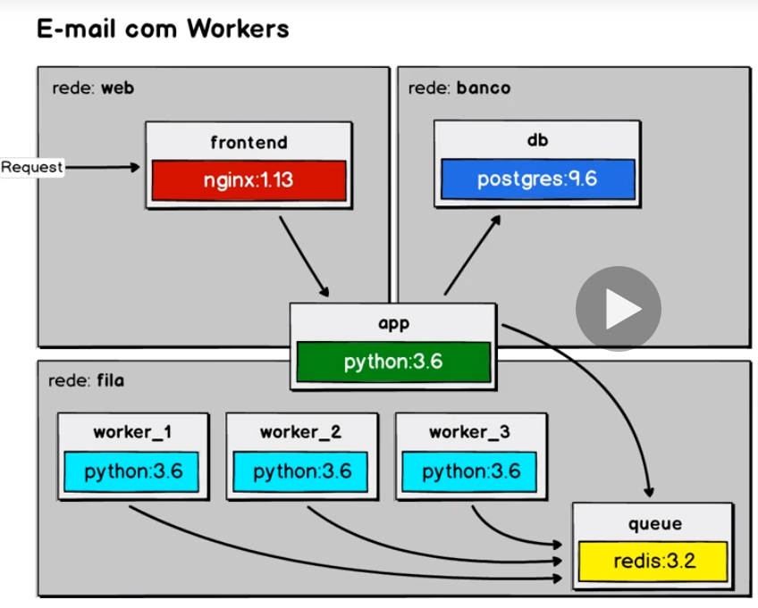

# E-mail com Workers

> Projeto desenvolvido para aplicação de conceitos abordados durante o curso.

## Descrição
Simulação de uma aplicação em Python que envia e-mails a partir de micro serviços.

### Estrutura

- [x] Iniando a composição com o banco de dados
- [x] Usando volumes e scripts de banco de dados
- [x] Começando camada de front-end
- [x] Aplicativo para enfileirar as mensagens
- [x] Configurando um proxy reverso
- [x] Redes, dependência e banco de dados
- [x] Fila e workers
- [x] Escalando aplicação
- [x] Aplicando conceito de [12 Factors](https://12factor.net/pt_br/)
- [x] Sobrescrever localmente

#### Modelagem



## Executando
Na pasta raiz do projeto executar o comando ```docker-compose up -d --scale worker=3```, após este processo poderá acessar o cadastro a partir da url [localhost](http://localhost) no navegador.