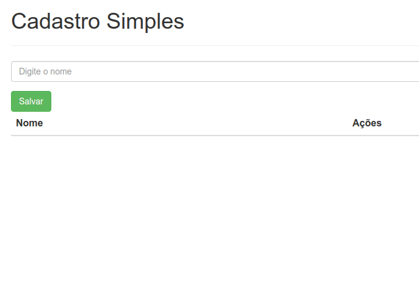

# Cadastro simples

> Projeto desenvolvido na sessão de ambiente dockerizado gerenciado com docker compose.

## Descrição
Criado um cadastro simples de nome. O ambiente conta com 3 serviços gerenciados pelo arquivo docker-compose.yml, um de banco de dados (MongoDB), outro para o _backend_ (NodeJS) e o _frontend_ (NGINX).

## Executando
Na pasta raiz do projeto executar o comando ```docker-compose up```, após este processo poderá acessar o cadastro a partir da url [localhost](http://localhost) no navegador.

## Screen Recorder
